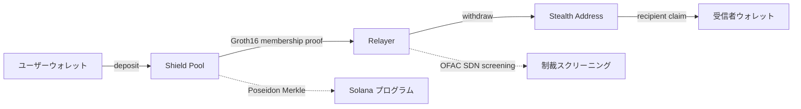

<div align="center">

> [English](README.md) · [日本語](README.ja.md)


# 斬り手 — KIRITE Protocol

**Solana 向けプライバシーレイヤー**

<a href="https://github.com/Kirite-dev/KIRITE-layer/blob/main/LICENSE"></a>
<a href="https://github.com/Kirite-dev/KIRITE-layer/actions"></a>
<a href="https://github.com/Kirite-dev/KIRITE-layer/releases"></a>
<a href="https://www.npmjs.com/package/@kirite/sdk"></a>
<a href="https://x.com/KiriteDev"></a>
<a href="https://kirite.dev"></a>

</div>

---

**Solana ウォレット、ただしプライベートに。**

SOL を相手に送るとき、自分のウォレット・金額・受信者のアドレスがブロックエクスプローラから紐付けられないようにします。共有シールドプールに SOL を入れる → 受信者は新規のワンタイムアドレスで受け取る → オンチェーン記録には「無関係に見える二つの動き」だけが残ります。Solana ネイティブ、L2 不要、ブリッジ不要。

`$KIRITE` トークンはプライベート転送のプロトコル手数料を獲得し、ステーカーへ分配します。

> **トークン CA:** `7iRJcjWHQMvdMXufPxLWBqfmBvikzETYTyjqnyCjpump` (Solana mainnet)

---

> このREADMEの以降は開発者・インテグレーター・ZK 読者向けです。エンドユーザーは [kirite.dev/docs](https://kirite.dev/docs) からどうぞ。

## アーキテクチャ



二つのコンポーネントが連動します。

- **Shield Pool** — Poseidon-Merkle コミットメントプール。デポジットはツリーに hash されて挿入。出金は「ツリーのいずれかのリーフを所持している」ことを Groth16 ゼロ知識証明で立証し、どのリーフかは公開しません。チェーンには nullifier hash と Merkle root のみが見えます。秘密値はユーザー端末から外に出ません。
- **Stealth Address** — 出金は受信者の公開 spend / view 鍵から派生するワンタイムアドレスに着金します (DKSAP)。受信者は view 鍵だけで着金スキャンが可能。受信者のメインアドレスはオンチェーンに一切現れません。

Solana ネイティブの `alt_bn128` および `poseidon` syscall を使用。証明生成はブラウザで snarkjs WASM (~1秒 デスクトップ / ~3秒 モバイル)。Non-custodial: プールの authority もユーザー資金を移動できません。

## プライバシーの仕組み

KIRITE は入金 ↔ 出金のリンクを断ち、受信者アドレスを隠します。Note はユーザー端末に留まり、vault は PDA でロックされます。

プライバシーを得るには固定単位 (`0.01` / `0.05` / `0.1` / `1` / `10` SOL) のいずれかで送金する必要があります。プール内の全ての入金・出金が同じ金額になるため、観測者はどの出金がどの入金と紐づくかを特定できません。匿名性はプールごとのアクティブ leaf 数 (v2 は 32,768 — Merkle 高さ 15) に依存します。

## 技術スタック

- **オンチェーン:** Anchor / Rust、Solana ネイティブ `alt_bn128` および `poseidon` syscall
- **ZK 回路:** Circom + Groth16 over BN254、Hermez powers-of-tau ceremony
- **クライアント:** snarkjs WASM ブラウザ証明生成 (~1秒 デスクトップ / ~3秒 モバイル)
- **SDK:** TypeScript ([@kirite/sdk](https://www.npmjs.com/package/@kirite/sdk))
- **Relayer:** Vercel ホスト Node、OFAC SDN 自動更新

## ビルド

`solana-cli >= 2.1`、`anchor >= 0.31`、`rust >= 1.85`、`node >= 20` が必要です。**単一モノレポではありません** — プログラムと SDK は同じソースツリーから独立してビルドします。

```bash
git clone https://github.com/Kirite-dev/KIRITE-layer.git
cd KIRITE-layer

# 1) オンチェーンプログラム (kirite プライバシー + kirite-staking)
anchor build
anchor test                       # 任意、ユニットテスト実行

# 2) TypeScript SDK (独立 — 1 と依存関係なし)
cd sdk
npm install
npm run build
cd ..

# 3) examples (任意)
cd examples && npm install && cd ..
```

各ステップは独立しています。`anchor build` は `target/` に Rust 成果物を、`npm run build` は `sdk/dist/` に TypeScript 成果物を出力します。一括ビルドする上位コマンドはありません。

## クイックスタート (TypeScript SDK)

```bash
npm install @kirite/sdk @solana/web3.js
```

```typescript
import { Connection, Keypair } from "@solana/web3.js";
import {
  KIRITE_PROGRAM_ID,
  DEFAULT_DENOMINATIONS,
  generateStealthMetaAddress,
} from "@kirite/sdk";
import { deposit, withdraw } from "@kirite/sdk/zk";

const connection = new Connection("https://api.mainnet-beta.solana.com");
const wallet = Keypair.generate();

// ステルスメタアドレスを公開 (受信者は一度だけ設定)
const meta = generateStealthMetaAddress(wallet);

// 固定単位でシールドプールにデポジット
const denomination = DEFAULT_DENOMINATIONS[3]; // 1 SOL
const note = await deposit({ connection, payer: wallet, denomination });
// note.ns, note.bf, note.leafIndex → 端末側に保存

// 後でステルスアドレスへ出金 (証明はクライアントで生成)
const sig = await withdraw({
  connection,
  note,
  recipient: stealthAddress.address,
  relayerUrl: "https://relayer.kirite.dev",
});
```

SDK の詳細: [kirite.dev/docs/sdk](https://kirite.dev/docs/sdk)

## プロジェクト構成

```
KIRITE-layer/
├── programs/
│   ├── kirite/                # プライバシープログラム (shield pool + stealth)
│   │   └── src/
│   │       ├── lib.rs
│   │       ├── instructions/  # deposit / withdraw / freeze
│   │       ├── state/         # ShieldPool / NullifierRecord
│   │       └── utils/
│   │           ├── zk.rs            # Groth16 verifier 接続
│   │           └── membership_vk.rs # 信頼付き設定の verifier key
│   └── kirite-staking/        # $KIRITE ステーキングプログラム (Token-2022)
├── circuits/
│   └── membership.circom      # Groth16 membership 証明回路
├── sdk/                       # @kirite/sdk (npm 公開済み)
│   └── src/
│       ├── kirite-zk.mjs      # v3 deposit/withdraw ヘルパー
│       ├── staking.mjs        # ステーキング instruction
│       ├── stealth/           # DKSAP ユーティリティ
│       ├── utils/
│       └── *.ts               # types / constants / errors
├── scripts/                   # 運用ヘルパー / 初期化スクリプト
├── tests/                     # 統合テスト
└── (詳細仕様は kirite.dev/docs)
```

## 匿名集合の上界

| アクティブ leaf 数 | 1 回あたり連結可能性の上界 |
| ---------------- | ----------------------- |
| 1               | 100% (実質透明)          |
| 10              | 10%                     |
| 100             | 1%                      |
| 1,000           | 0.1%                    |
| 32,768 (v2 上限) | ~0.003%                |

これは上界です。実世界の攻撃者はタイミングやパターン解析を併用してさらに絞り込みます。実用的なプライバシーはトラフィック量に比例します。

## コンプライアンス

- **OFAC SDN 自動更新** をリレーヤーで実施 (週次 Treasury XML プル)
- **緊急時 freeze 権限** (ユーザー資金は動かせず、新規動作のみ停止)
- **公開報告チャネル:** `report@kirite.dev`
- 全文: [kirite.dev/docs/compliance](https://kirite.dev/docs/compliance)

## セキュリティ

KIRITE は第三者監査を受けていません。信頼付き設定は Hermez powers-of-tau セレモニーを使用し、Phase 2 は単独貢献となっています。多者参加セレモニーと有料セキュリティレビューは今後のロードマップに含まれています。コードは公開され、コミットハッシュは本番デプロイ済みプログラムと照合可能です。

セキュリティ脆弱性の報告は [SECURITY.md](./SECURITY.md) を参照してください。公開 issue で報告しないでください。

## ライセンス

[MIT](./LICENSE)

## リンク

- ウェブサイト: https://kirite.dev
- ドキュメント: https://kirite.dev/docs
- X: https://x.com/KiriteDev
- npm: https://www.npmjs.com/package/@kirite/sdk
- ティッカー: $KIRITE (CA: `7iRJcjWHQMvdMXufPxLWBqfmBvikzETYTyjqnyCjpump`)
