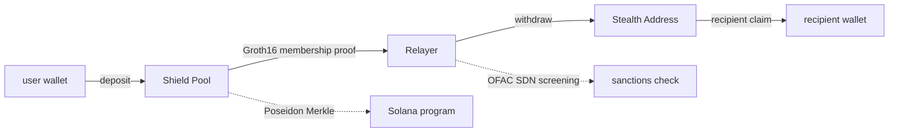

<div align="center">

> [English](README.md) · [日本語](README.ja.md)


<a href="https://github.com/Kirite-dev/KIRITE-layer/blob/main/LICENSE"></a>
<a href="https://github.com/Kirite-dev/KIRITE-layer/actions"></a>
<a href="https://github.com/Kirite-dev/KIRITE-layer/releases"></a>
<a href="https://www.npmjs.com/package/@kirite/sdk"></a>
<a href="https://www.rust-lang.org"></a>
<a href="https://www.anchor-lang.com"></a>
<a href="https://x.com/KiriteDev"></a>
<a href="https://kirite.dev"></a>

</div>

---

KIRITE is a privacy layer on Solana. A Tornado-style ZK shield pool with stealth-address recipients, deployed Solana-native. Same broad ZK-privacy family as Aztec, Railgun, and Tornado Cash. Architecturally closest to Tornado (fixed-denomination Merkle pool), with stealth-address recipients on top.

The `$KIRITE` token captures protocol fees from private transfers and routes them to stakers.

> **Token CA:** `7iRJcjWHQMvdMXufPxLWBqfmBvikzETYTyjqnyCjpump` (Solana mainnet)

## Architecture



Two pieces working together:

- **Shield Pool** — Poseidon-Merkle commitment pool. Deposits hash into a tree. Withdraws prove "I own one of the leaves" via a Groth16 zero-knowledge proof, without revealing which leaf. The chain only sees a nullifier hash and a Merkle root. The secret stays on the user's device.
- **Stealth Address** — Withdraws land on a one-time address derived from the recipient's public spend + view keys (DKSAP). The recipient scans for incoming notes with the view key alone. The recipient's main address never appears on-chain.

Built on Solana's native `alt_bn128` and `poseidon` syscalls. Browser-side proof generation via snarkjs WASM (~1s desktop, ~3s mobile). Non-custodial: the pool authority cannot move user funds.

## How privacy works

KIRITE breaks the deposit ↔ withdraw link and hides the recipient address. Notes stay on the user's device; the vault is PDA-locked.

Privacy requires sending in one of the fixed denominations: `0.01` / `0.05` / `0.1` / `1` / `10` SOL. Every deposit and withdraw in a pool moves the same exact amount, so observers cannot match a withdraw to its specific deposit. Anonymity is bounded by the active leaf count per pool (32,768 on v2 — Merkle height 15).

## Tech stack

- **On-chain:** Anchor / Rust, Solana native `alt_bn128` and `poseidon` syscalls
- **ZK circuits:** Circom + Groth16 over BN254, Hermez powers-of-tau ceremony
- **Client:** snarkjs WASM for browser proof generation (~1s desktop, ~3s mobile)
- **SDK:** TypeScript ([@kirite/sdk](https://www.npmjs.com/package/@kirite/sdk))
- **Relayer:** Vercel-hosted Node, OFAC SDN auto-refresh

## Build

Requires `solana-cli >= 1.18`, `anchor >= 0.30`, `rust >= 1.75`, `node >= 20`.

```bash
git clone https://github.com/Kirite-dev/KIRITE-layer.git
cd KIRITE-layer

# build the on-chain programs (kirite + kirite-staking)
anchor build

# run the on-chain test suite
anchor test

# build the SDK
cd sdk && npm install && npm run build
```

## Quick start (TypeScript SDK)

```bash
npm install @kirite/sdk @solana/web3.js
```

```typescript
import { Connection, Keypair } from "@solana/web3.js";
import {
  KIRITE_PROGRAM_ID,
  DEFAULT_DENOMINATIONS,
  generateStealthMetaAddress,
} from "@kirite/sdk";
import { deposit, withdraw } from "@kirite/sdk/zk";

const connection = new Connection("https://api.mainnet-beta.solana.com");
const wallet = Keypair.generate();

// publish a stealth meta-address (one-time setup per recipient)
const meta = generateStealthMetaAddress(wallet);

// deposit a fixed denomination into the shield pool
const denomination = DEFAULT_DENOMINATIONS[3]; // 1 SOL
const note = await deposit({ connection, payer: wallet, denomination });
// note.ns, note.bf, note.leafIndex → persist on the depositor's device

// later, withdraw to a stealth address (proof generated client-side)
const sig = await withdraw({
  connection,
  note,
  recipient: stealthAddress.address,
  relayerUrl: "https://relayer.kirite.dev",
});
```

Full SDK docs: [kirite.dev/docs/sdk](https://kirite.dev/docs/sdk).

## Project structure

```
KIRITE-layer/
├── programs/
│   ├── kirite/                # privacy program (shield pool + stealth)
│   │   └── src/
│   │       ├── lib.rs
│   │       ├── instructions/  # deposit, withdraw, freeze
│   │       ├── state/         # ShieldPool, NullifierRecord
│   │       └── utils/
│   │           ├── zk.rs            # Groth16 verifier glue
│   │           └── membership_vk.rs # trusted-setup verifier key
│   └── kirite-staking/        # $KIRITE staking program (Token-2022)
├── circuits/
│   └── membership.circom      # Groth16 membership proof circuit
├── sdk/                       # @kirite/sdk on npm
│   └── src/
│       ├── kirite-zk.mjs      # v3 deposit/withdraw helpers
│       ├── staking.mjs        # staking instructions
│       ├── stealth/           # DKSAP utilities
│       ├── utils/
│       └── *.ts               # types, constants, errors
├── scripts/                   # operational helpers, init scripts
├── tests/                     # integration tests
└── docs/                      # protocol spec
```

## Anonymity-set bounds

| Active leaves | Upper bound on linkability per attempt |
| ------------- | -------------------------------------- |
| 1             | 100% (effectively transparent)         |
| 10            | 10%                                    |
| 100           | 1%                                     |
| 1,000         | 0.1%                                   |
| 32,768 (v2 cap) | ~0.003%                              |

These are upper bounds. Real-world adversaries combine timing and pattern analysis to narrow further. Practical privacy scales with traffic.

## Compliance

- **OFAC SDN auto-refresh** at the relayer (weekly Treasury XML pull)
- **Freeze authority** for emergency response (cannot move user funds, only halt new activity)
- **Public reporting channel:** `report@kirite.dev`
- Full posture: [kirite.dev/docs/compliance](https://kirite.dev/docs/compliance)

## Security

KIRITE has not yet undergone a third-party audit. The trusted setup uses the public Hermez powers-of-tau ceremony with a single Phase 2 contributor. A multi-party ceremony and a paid security review are planned follow-ons. Code is public and commit hashes verify against the deployed program.

For security disclosures, see [SECURITY.md](./SECURITY.md). Do not open public issues for security bugs.

## License

[MIT](./LICENSE)

## Links

- Website: https://kirite.dev
- Docs: https://kirite.dev/docs
- X: https://x.com/KiriteDev
- npm: https://www.npmjs.com/package/@kirite/sdk
- Ticker: $KIRITE (CA: `7iRJcjWHQMvdMXufPxLWBqfmBvikzETYTyjqnyCjpump`)
