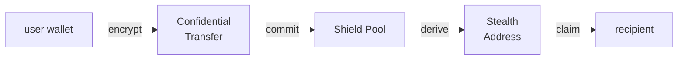

<div align="center">


### 切手 — A Native Privacy Layer for Solana

**The signature exists. The hand does not.**

`署名は存在する。しかし、その手は誰にも見えない。`

[ Website ](https://kirite-web.vercel.app) · [ Docs ](./docs/architecture.md) · [ Spec ](./docs/protocol-spec.md)

</div>

---

## What KIRITE Solves

Every transaction on Solana is naked. Your balance, your recipient, your timing — broadcast to the entire network in real-time. Bots front-run you in 400ms. Analytics firms cluster your wallets. Copy-traders replicate your moves before you finish typing.

KIRITE is a three-layer privacy protocol that makes transactions cryptographically invisible. Built on Solana's native `Confidential Balances` token extension. No mixers. No bridges. No third-party trust.

<table>
<tr>
<th width="50%" align="center">Without KIRITE</th>
<th width="50%" align="center">With KIRITE</th>
</tr>
<tr>
<td valign="top">

```
sender    7xK9..3fQ2
amount    14,000 USDC
recipient 9mR2..xK7P
timestamp 14:32:07 UTC
status    ⚠ visible to everyone
```

</td>
<td valign="top">

```
sender    ████████████
amount    ████████████
recipient ████████████
timestamp ████████████
status    ✓ encrypted on-chain
```

</td>
</tr>
</table>

## ░░░ The Three Layers ░░░

### `01 — Confidential Transfer`

Transaction amounts encrypted using **Twisted ElGamal**, built directly on Solana's `Confidential Balances` token extension. The validator verifies a zero-knowledge range proof without ever decrypting the ciphertext.

### `02 — Shield Pool`

A multi-asset anonymity set with time-locked withdrawal windows. Merkle tree commitments with nullifier-based double-spend prevention. The link between sender and receiver is cryptographically broken.

### `03 — Stealth Address`

ECDH dual-key derivation generates a fresh one-time address per transaction. The recipient scans an on-chain registry with their view key. No external observer can link the address to their identity.

## ░░░ Phantom Protocol ░░░



**Confidential Transfer** sits closest to the token layer, wrapping SPL token operations with homomorphic encryption. **Shield Pool** operates above, pooling deposits and withdrawals to break transaction graph analysis. **Stealth Address** provides the outermost privacy layer, ensuring recipients cannot be identified even by observers who monitor pool activity.

## ░░░ Quick Start ░░░

```bash
# clone
git clone https://github.com/KIRITE-labs/kirite-protocol.git
cd kirite-protocol

# build (requires solana cli + anchor)
anchor build

# test
anchor test

# install sdk
cd sdk && npm install && npm run build
```

### TypeScript SDK

```typescript
import { KiriteClient, ShieldPool, StealthAddress } from "@kirite/sdk";
import { Connection, Keypair } from "@solana/web3.js";

const connection = new Connection("https://api.mainnet-beta.solana.com");
const wallet = Keypair.fromSecretKey(/* your key */);
const kirite = new KiriteClient(connection, wallet);

// confidential transfer
const tx = await kirite.confidentialTransfer({
  mint: TOKEN_MINT,
  recipient: recipientPublicKey,
  amount: 1_000_000,
});

// shield pool deposit
const pool = new ShieldPool(kirite);
const note = await pool.deposit({ mint: TOKEN_MINT, amount: 1_000_000 });
// → save note.commitment & note.nullifier offline

// shield pool withdraw (from any wallet)
await pool.withdraw({
  commitment: note.commitment,
  nullifier: note.nullifier,
  recipient: newWalletPublicKey,
});
```

### CLI

```bash
kirite init --mint <MINT_ADDRESS>
kirite transfer --mint <MINT_ADDRESS> --to <RECIPIENT> --amount 100
kirite pool deposit --mint <MINT_ADDRESS> --amount 50
kirite pool withdraw --commitment <COMMITMENT> --to <RECIPIENT>
kirite stealth generate --spend-key <SPEND_KEY>
kirite stealth scan --spend-key <SPEND_KEY> --view-key <VIEW_KEY>
```

## ░░░ Stack ░░░

| Layer | Technology |
| ----- | ---------- |
| Smart Contract | Rust · Anchor · Solana Program |
| Cryptography | Twisted ElGamal · Bulletproofs · ECDH |
| SDK | TypeScript · @solana/web3.js |
| CLI | TypeScript · Commander |
| Network | Solana Devnet (Mainnet soon) |

## ░░░ Status ░░░

```
[████████████████████░░░░] 80% complete

✓ Solana program deployed
✓ 28/28 on-chain tests passed
✓ Confidential Transfer wrapper
✓ Shield Pool with Merkle tree
✓ Stealth Address registry
✓ TypeScript SDK
✓ CLI
✓ Documentation
○ Security audit
○ Mainnet deployment
○ $KIRITE token launch
```

## ░░░ Security Model ░░░

> Trust the cryptography. Not the team.

- **Non-custodial.** Funds locked in a smart contract. No admin withdrawal. No multisig override. No emergency drain.
- **Client-side proofs.** Encryption runs in your browser via WASM. The server never touches your data.
- **Solana L1 native.** Built on Confidential Balances — verified directly by the Solana runtime.
- **Open source.** Every line of code is public. Read it. Run it. Verify it on-chain.
- **Immutable.** Even if KIRITE disappears tomorrow, the protocol keeps running on Solana.

KIRITE handles private financial data. If you discover a vulnerability, please follow our [responsible disclosure process](./SECURITY.md). Do not open public issues for security bugs.

## ░░░ Project Structure ░░░

```
kirite-protocol/
├── programs/
│   └── kirite/             ← Anchor on-chain program
│       └── src/
│           ├── instructions/
│           ├── state/
│           ├── utils/
│           └── lib.rs
├── sdk/                    ← TypeScript SDK
│   └── src/
│       ├── client.ts
│       ├── confidential/
│       ├── shield-pool/
│       ├── stealth/
│       └── utils/
├── cli/                    ← Command-line tool
│   └── src/
│       ├── commands/
│       └── utils/
├── scripts/                ← Deployment scripts
├── docs/                   ← Architecture & protocol specs
└── migrations/             ← Anchor migrations
```

## ░░░ Contributing ░░░

See [CONTRIBUTING.md](./CONTRIBUTING.md) for development setup, code style, and PR guidelines.

## ░░░ License ░░░

[MIT](./LICENSE) — Copyright 2025–2026 KIRITE Contributors

---

<div align="center">

```
██  KIRITE  ██  v0.1.0  ██  Solana Devnet  ██

切手 — 署名は存在する。その手は見えない。
```

</div>
