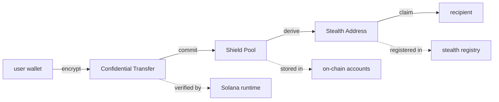

<div align="center">

> [English](README.md) · [日本語](README.ja.md)


<a href="https://github.com/Kirite-dev/KIRITE/blob/main/LICENSE"></a>
<a href="https://github.com/Kirite-dev/KIRITE/actions"></a>
<a href="https://github.com/Kirite-dev/KIRITE/releases"></a>
<a href="https://explorer.solana.com/address/4bUHrDPuRcoYPU7UTLojXtxJsWoCj3HJbKX9oLnEnYy6?cluster=devnet"></a>
<a href="https://www.rust-lang.org"></a>
<a href="https://www.anchor-lang.com"></a>
<a href="https://github.com/Kirite-dev/KIRITE/stargazers"></a>
<a href="https://x.com/KiriteDev"></a>
<a href="https://kirite.dev"></a>

</div>

---

KIRITE is a privacy payment layer for Solana that hides transaction amounts, sender-receiver links, and recipient addresses. Built on the Confidential Balances token extension with Anchor and Rust. SDK in TypeScript.

> Deployed on Solana Devnet: [`4bUHrDPuRcoYPU7UTLojXtxJsWoCj3HJbKX9oLnEnYy6`](https://explorer.solana.com/address/4bUHrDPuRcoYPU7UTLojXtxJsWoCj3HJbKX9oLnEnYy6?cluster=devnet) · [Solscan](https://solscan.io/account/4bUHrDPuRcoYPU7UTLojXtxJsWoCj3HJbKX9oLnEnYy6?cluster=devnet)

## Features

| Feature                       | Status   | Notes                                                       |
| ----------------------------- | -------- | ----------------------------------------------------------- |
| Confidential Transfer         | stable   | Twisted ElGamal encryption on top of Token Extensions       |
| Shield Pool                   | stable   | Multi-asset Merkle commitment pool with nullifier tracking  |
| Stealth Address               | stable   | Dual-key ECDH derivation with on-chain ephemeral registry   |
| Configurable Privacy Levels   | beta     | Instant / Standard / Maximum delay tiers                    |
| View Key Selective Disclosure | beta     | Optional auditor view key for compliant disclosure          |
| Cross-chain Bridge            | alpha    | Privacy-preserving bridge to EVM (research phase)           |

## Architecture



The protocol is composed of three independent layers. Each one removes a different metadata leakage vector. They can be used in isolation or combined for end-to-end transaction invisibility.

## Performance

| Operation                    | Compute Units | Latency      | Cost                |
| ---------------------------- | ------------- | ------------ | ------------------- |
| Confidential transfer        | ~85,000 CU    | < 400 ms     | ~0.000005 SOL       |
| Shield pool deposit          | ~120,000 CU   | < 500 ms     | ~0.000007 SOL       |
| Shield pool withdraw         | ~180,000 CU   | < 700 ms     | ~0.000010 SOL       |
| Stealth address derivation   | client-side   | < 50 ms      | none                |
| Proof generation (browser)   | client-side   | < 1 ms       | none                |

## Risk and Privacy Score

| Configuration                          | Anonymity Set | Linkability Resistance | Recommended For                  |
| -------------------------------------- | ------------- | ---------------------- | -------------------------------- |
| Confidential Transfer only             | n/a           | low                    | hiding amounts                   |
| Confidential Transfer + Shield Pool    | medium        | medium                 | regular DeFi privacy             |
| Full stack (CT + SP + Stealth)         | large         | high                   | high-value transfers             |

## Build

Requires `solana-cli >= 1.18`, `anchor >= 0.30`, `rust >= 1.75`, `node >= 20`.

```bash
git clone https://github.com/Kirite-dev/KIRITE.git
cd KIRITE

# build the on-chain program
anchor build

# run the on-chain test suite
anchor test

# build the SDK
cd sdk && tsc

# build the CLI
cd ../cli && tsc
```

## Quick Start

### Rust (on-chain program)

```rust
use anchor_lang::prelude::*;
use kirite::cpi::accounts::Deposit;
use kirite::program::Kirite;

// Compose a deposit into the shield pool from another Anchor program
pub fn deposit_via_kirite(ctx: Context<DepositViaKirite>) -> Result<()> {
    let cpi_ctx = CpiContext::new(
        ctx.accounts.kirite_program.to_account_info(),
        Deposit {
            shield_pool: ctx.accounts.shield_pool.to_account_info(),
            depositor: ctx.accounts.user.to_account_info(),
            // ... other accounts
        },
    );

    kirite::cpi::deposit(cpi_ctx, params)
    // returns Ok(()) on success
}
```

### TypeScript (SDK)

```typescript
import { KiriteClient, ShieldPool, StealthAddress } from "@kirite/sdk";
import { Connection, Keypair, PublicKey } from "@solana/web3.js";

const connection = new Connection("https://api.mainnet-beta.solana.com");
const wallet = Keypair.fromSecretKey(/* ... */);
const kirite = new KiriteClient(connection, wallet);

// 1. confidential transfer
const tx = await kirite.confidentialTransfer({
  mint: USDC_MINT,
  recipient: recipientPubkey,
  amount: 1_000_000,
});
// { signature: "5kF...x9q", encryptedAmount: <Uint8Array>, status: "confirmed" }

// 2. shield pool deposit
const pool = new ShieldPool(kirite);
const note = await pool.deposit({ mint: SOL_MINT, amount: 1_000_000_000 });
// { commitment: "0x4b2f...e9d0", nullifier: "0xa9f3...10b4", leafIndex: 142 }

// 3. shield pool withdraw to a different wallet
const result = await pool.withdraw({
  commitment: note.commitment,
  nullifier: note.nullifier,
  recipient: newWalletPubkey,
});
// { signature: "3pY...zK1", privacyLevel: "standard", anonymitySet: 24 }

// 4. stealth address generation
const stealth = new StealthAddress(kirite);
const { address, ephemeralPubkey } = stealth.generate(recipientSpendKey, recipientViewKey);
// { address: PublicKey, ephemeralPubkey: PublicKey }
```

### Bash (CLI)

```bash
# initialize a confidential token account
kirite init --mint EPjFWdd5AufqSSqeM2qN1xzybapC8G4wEGGkZwyTDt1v

# confidential transfer
kirite transfer \
  --mint EPjFWdd5AufqSSqeM2qN1xzybapC8G4wEGGkZwyTDt1v \
  --to 9mR2xK7PDvBQVjNrW8FpqLg3KfZsdH4kXvT2YAbRcEnp \
  --amount 100

# shield pool deposit
kirite pool deposit --mint So11111111111111111111111111111111111111112 --amount 1.0

# shield pool withdraw with privacy level
kirite pool withdraw \
  --commitment 0x4b2f...e9d0 \
  --nullifier 0xa9f3...10b4 \
  --to 7xK93fQ2RvBQVjNrW8FpqLg3KfZsdH4kXvT2YAbRcEnp \
  --privacy maximum

# stealth address scan
kirite stealth scan --view-key ./keys/view.json
```

## Project Structure

```
KIRITE/
├── programs/
│   └── kirite/
│       └── src/
│           ├── lib.rs                    # program entrypoint
│           ├── errors.rs                 # KiriteError variants
│           ├── events.rs                 # DepositCommitted, WithdrawalProcessed, etc.
│           ├── instructions/
│           │   ├── initialize.rs         # initialize_protocol, initialize_shield_pool
│           │   ├── deposit.rs            # deposit, do_merkle_insert, do_token_transfer
│           │   ├── withdraw.rs           # withdraw, verify_withdrawal_proof
│           │   ├── transfer.rs           # confidential_transfer, apply_pending_balance
│           │   ├── create_stealth.rs     # register_stealth_registry, claim_stealth
│           │   └── governance.rs         # pause, resume, fee updates, signer rotation
│           ├── state/
│           │   ├── protocol.rs           # ProtocolConfig, GovernanceState
│           │   ├── shield_pool.rs        # ShieldPool, PoolEntry, NullifierSet
│           │   └── stealth.rs            # StealthRegistry, EphemeralKey
│           └── utils/
│               ├── crypto.rs             # twisted elgamal, merkle, ECDH derivation
│               ├── validation.rs         # input checks, denomination, timelock bounds
│               └── math.rs               # fee calc, overflow-checked arithmetic
├── sdk/
│   └── src/
│       ├── client.ts                     # KiriteClient main class
│       ├── types.ts                      # public type definitions
│       ├── constants.ts                  # program ID, seeds, defaults
│       ├── errors.ts                     # SDK error classes
│       ├── confidential/
│       │   ├── encryption.ts             # ElGamal encrypt/decrypt
│       │   ├── proof.ts                  # range proof generation
│       │   └── transfer.ts               # confidential transfer flow
│       ├── shield-pool/
│       │   ├── deposit.ts                # build deposit instruction
│       │   ├── withdraw.ts               # build withdraw instruction
│       │   └── pool-state.ts             # pool queries, anonymity set size
│       ├── stealth/
│       │   ├── address.ts                # one-time address derivation
│       │   ├── registry.ts               # registry read/write
│       │   └── scan.ts                   # scan for incoming payments
│       └── utils/
│           ├── connection.ts             # RPC helpers
│           ├── keypair.ts                # key derivation
│           └── transaction.ts            # tx builder helpers
├── cli/
│   └── src/
│       ├── index.ts                      # commander entrypoint
│       ├── commands/
│       │   ├── config.ts                 # config get/set
│       │   ├── deposit.ts                # pool deposit subcommand
│       │   ├── withdraw.ts               # pool withdraw subcommand
│       │   ├── transfer.ts               # confidential transfer subcommand
│       │   ├── stealth.ts                # stealth scan/generate
│       │   └── pool.ts                   # pool info queries
│       └── utils/
│           ├── config.ts                 # config persistence
│           ├── wallet.ts                 # keypair loading
│           └── display.ts                # formatted CLI output
├── tests/
│   ├── test-devnet.ts                    # devnet smoke tests
│   └── test-full.ts                      # full integration suite (28 cases)
├── examples/
│   ├── 01-confidential-transfer.ts       # confidential transfer example
│   ├── 02-shield-pool-deposit.ts         # deposit + nullifier note
│   └── 03-stealth-address.ts             # generate + scan stealth payments
├── scripts/
│   ├── deploy.sh                         # cluster deployment
│   ├── migrate.ts                        # post-deploy initialization
│   ├── verify.sh                         # deployment verification
│   └── idl-publish.sh                    # IDL registry publish
├── docs/
│   ├── architecture.md                   # system design
│   ├── protocol-spec.md                  # cryptographic specification
│   └── deployment-guide.md               # operator guide
├── migrations/
│   └── deploy.ts                         # anchor migration
├── .github/
│   ├── workflows/
│   │   └── ci.yml                        # build, test, lint
│   ├── ISSUE_TEMPLATE/
│   │   ├── bug_report.md
│   │   └── feature_request.md
│   ├── pull_request_template.md
│   └── dependabot.yml
├── Anchor.toml
├── Cargo.toml
├── package.json
├── README.md
├── LICENSE
├── CONTRIBUTING.md
├── CHANGELOG.md
└── SECURITY.md
```

## Security

KIRITE handles encrypted financial data. Report vulnerabilities through the process described in [SECURITY.md](./SECURITY.md). Do not open public issues for security bugs.

## Contributing

See [CONTRIBUTING.md](./CONTRIBUTING.md) for development setup, code style, and PR guidelines.

## License

[MIT](./LICENSE)

## Deployments

| Network         | Program ID                                       | Status   |
| --------------- | ------------------------------------------------ | -------- |
| Solana Devnet   | `4bUHrDPuRcoYPU7UTLojXtxJsWoCj3HJbKX9oLnEnYy6`   | live     |
| Solana Mainnet  | _pending audit_                                  | upcoming |

Verify the devnet deployment on [Solana Explorer](https://explorer.solana.com/address/4bUHrDPuRcoYPU7UTLojXtxJsWoCj3HJbKX9oLnEnYy6?cluster=devnet).

## Links

- Website: https://kirite.dev
- X: https://x.com/KiriteDev
- GitHub: https://github.com/Kirite-dev/KIRITE
- Ticker: $KIRITE
